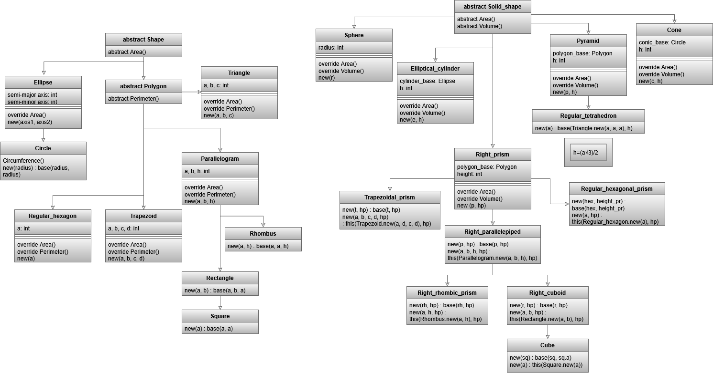

# ruby-shape-area-gem

Гем с классами фигур и подсчётом их площади.

### Планируемые фигуры:

1\) Куб, cube

2\) Прямоугольный параллелепипед, cuboid

3\) Сфера, sphere

4\) Правильная треугольная пирамида/тетраэдр, tetrahedron

5\) Ромбовидная прямая призма, rhombic\_prism, диагонали основания и высота

6\) Трапецивидная прямая призма, trapezoid\_prism

7\) Параллелипипед (прямой), parallelipiped

8\) прямой эллиптический цилиндр, elliptical\_cylinder 

9\) Конус, cone

10\) Шестиугольная прямая призма, hexagonal\_prism

### Диаграмма наследования:

